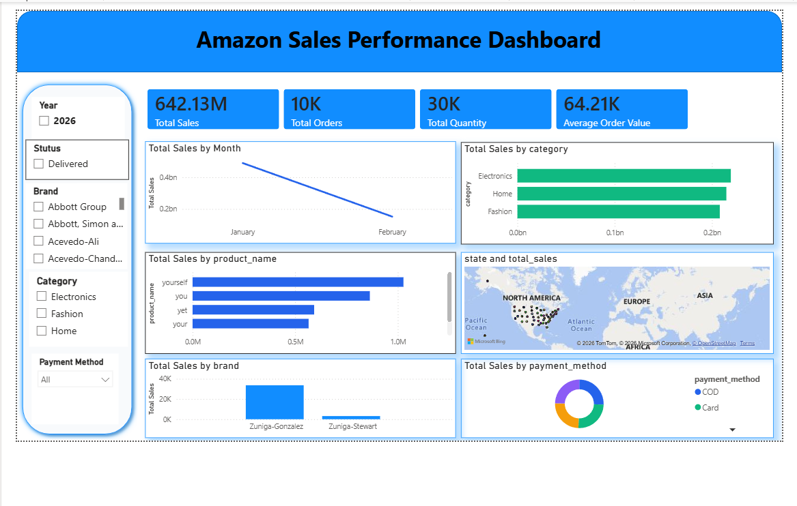

📊 Amazon Sales Analysis

 📊 Dashboard Preview




 📌 Project Overview

This project demonstrates an end-to-end data analytics workflow using an Amazon Sales dataset. The objective is to transform raw sales data into actionable business insights through data cleaning, SQL analysis, and an interactive Power BI dashboard.

 🎯 Project Objectives

* Clean and preprocess raw sales data using Python.
* Analyze business performance using SQL.
* Build an interactive Power BI dashboard.
* Identify sales trends and generate business recommendations.


 🛠️ Tools & Technologies

* Python (Pandas)
* MySQL
* Power BI
* DAX
* Git & GitHub


 📂 Dataset

* Rows: **10,000**
* Columns: **21**

Key fields include:

* Order Date
* Customer
* Product
* Category
* Brand
* Quantity
* Total Sales
* Payment Method
* State
* City


📈 Dashboard Features

* 💰 Total Sales KPI
* 📦 Total Orders
* 🛒 Total Quantity Sold
* 📈 Monthly Sales Trend
* 🏷️ Sales by Category
* ⭐ Top Products
* 🗺️ Sales by State
* 🏢 Sales by Brand
* 💳 Payment Method Analysis
* 🎛️ Interactive Filters


 🔍 Key Business Insights

* Sales performance varies across product categories.
* Monthly sales trends help identify seasonal demand.
* High-performing brands contribute a significant share of revenue.
* Geographic analysis highlights strong sales regions.
* Payment method analysis provides customer purchasing insights.


 📁 Project Structure

```text
amazon-sales-analysis/
│
├── data/
├── sql/
├── dashboard/
├── reports/
├── images/
└── README.md
```


 🚀 Future Improvements

* Sales forecasting using machine learning.
* Customer segmentation.
* Profitability analysis.
* Automated Power BI data refresh.


## 👤 Author

**Ritesh Malkar**

GitHub: https://github.com/riteshmalkar72-lab
